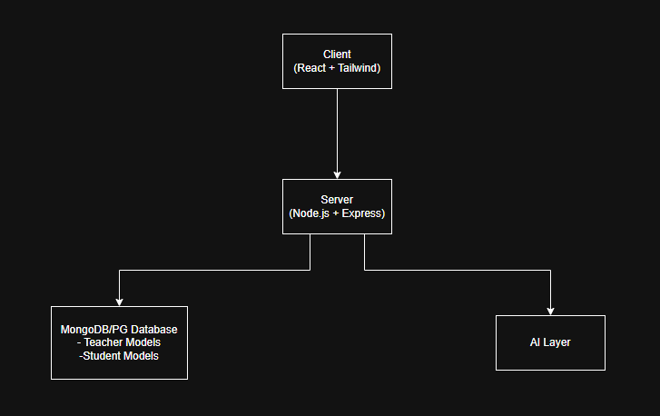
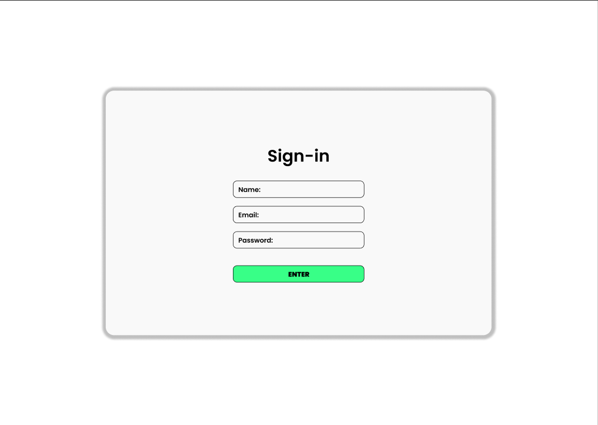
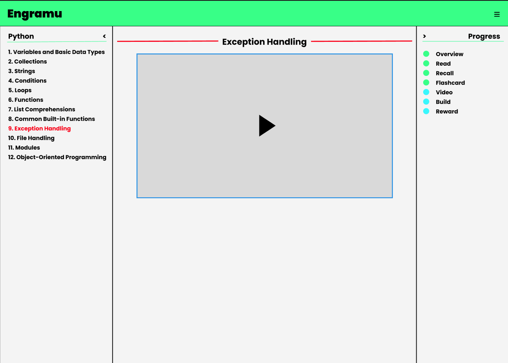
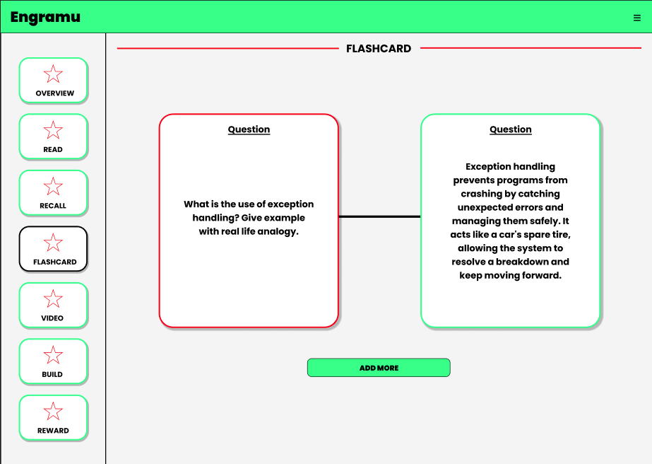
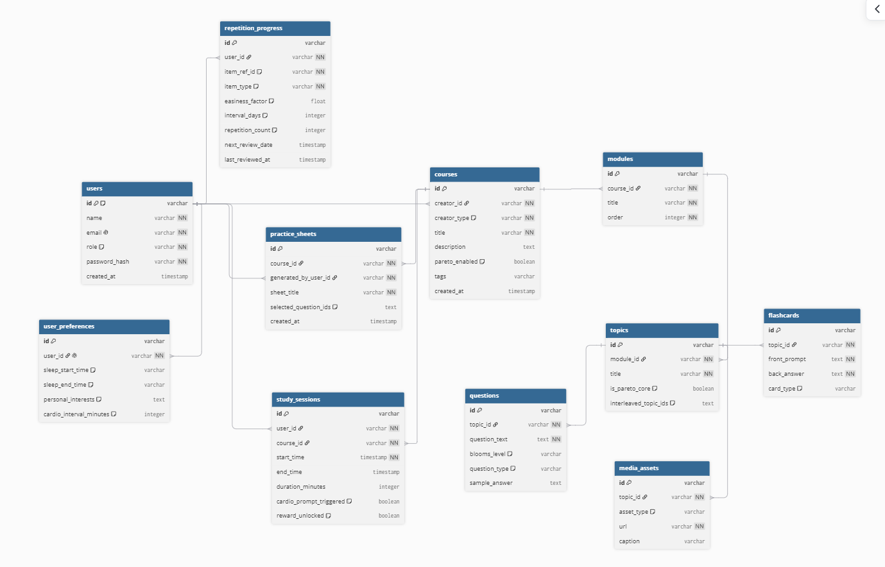

# Engramu
Engramu is an intelligent and neuroscience-backed learrning platform to enable learning in the most effective way possible. Rules are enforced on both teachers and students, which results into best learning environment.

---

### HLD:

The system consists of two primary user roles—**Teacher** and **Student**—with built-in capability for students to generate micro-courses using AI. Core services include:
* **Authentication Service:** Role-based access control (RBAC).
* **AI Service:** Powered by Gemini for course generation, curiosity prompting, and contextual feedback.
* **Caching Layer:** Aggressive Redis-based caching to optimize response times and reduce API costs.

---

### Track- Fullstack

---

### Tech Stack

| Domain | Technology |
| :--- | :--- |
| **Language** | TypeScript |
| **Frontend** | React, Tailwind CSS |
| **Backend** | Node.js, Express.js |
| **Database** | MongoDB |
| **Caching** | Redis |
| **AI Integration** | Google Gemini API |

---

### Core Features for MVP:

#### For creating course:

1. 80/20 Rule Implementation: AI based topic selection covering core of topic.
2. Flashcards, Images, Text, Video: Prioritized format for learning.
3. Questions based on Bloom's Taxonomy
4. Mix Related Topics
5. Practice Sheet

#### For learning:

6. Active Recalling
7. Spaced Repitition
8. AI Questions for Curuosity
9. AI Feedback
10. Suggest Cardio
11. Ask for things he like and rewarding after completion of tasks
12. No study in sleeping hours
13. Breaks after sessions

### Phase 1 MVP (P0 - Critical)
1. **Role-Based Authentication:** Distinct onboarding and dashboards for Teachers and Students.
2. **AI Course Generation (80/20 Rule):** Automated extraction of high-yield core concepts.
3. **Active Recall & Spaced Repetition Engine:** Dynamic scheduling of flashcards and practice quizzes.
4. **Bloom’s Taxonomy Assessment:** Auto-generated questions categorizing knowledge levels (Remember, Understand, Apply, Analyze).

### Phase 2 MVP (P1 - Priority)
5. **Multi-Format Content Support:** Flashcards, images, rich text, and embedded video.
6. **AI Feedback & Curiosity Prompts:** Adaptive hints and open-ended questions during study sessions.
7. **Study Rule Enforcement:** Automated limits (e.g., compulsory session breaks, sleeping-hour lockouts).

### Future Roadmap (P2 - Advanced)
8. **Personalized Reward System:** Task-based habit tracking and custom rewards.
9. **Cardio & Movement Prompts:** Intermittent wellness notifications during long study blocks.

## Figma

Visit [Figma Views](https://www.figma.com/design/EZvWVvpNfqXxVa1umPKQAV/Engramu?node-id=0-1&t=nK2OFgvxWNWZeJOO-1) for mock designs.

### Sign-in Page:

### Student Page:

### Teacher Page:

## ERD

This is moch ERD and can change according to reqirements.

#### Entity Relationship Diagram:
